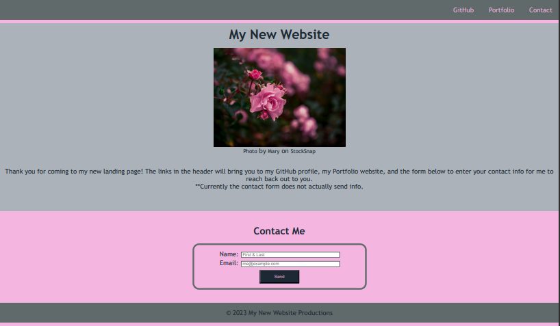

# html-css-git-mini-1

## Description
Mini-Project #1 for HTML, CSS, Git, creating a contact form landing page

This project was built to give my work a basic landing page, which will give my later portfolio a bit more meat to show the work that I've been completing throughout coding bootcamp. Through the process of this project, I learned how to build a basic html and css stylesheet from scratch, how to implement pieces I've learned through the first module such as forms, and how to make sure the website still includes accessibility and media screen features for easier accessibility of the website.

## Usage

Deployed application: https://jskelly8.github.io/html-css-git-mini-1/ 

## Credits

README template used from: https://coding-boot-camp.github.io/full-stack/github/professional-readme-guide edX Boot Camps LLC. (2022, October 27). Professional readme guide. Professional README Guide | The Full-Stack Blog. https://coding-boot-camp.github.io/full-stack/github/professional-readme-guide 

Photo used from free-to-use photo library site:
Mary. (n.d.). Free stock photos from Mary - StockSnap.io. StockSnap. Retrieved October 24, 2023, from https://stocksnap.io/author/marymaaret 
